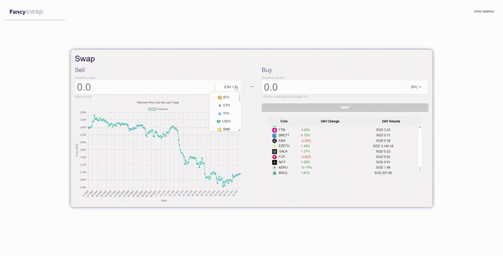

# Crypto Exchange Dashboard
A real-time crypto exchange dashboard that provides up-to-date cryptocurrency rates and price changes. The application fetches all the data dynamically from online sources, including cryptocurrency images, current exchange rates, and historical price changes. Users can select different cryptocurrencies and view detailed information about their price trends and exchange rates in various fiat currencies.

# Features
* **Real-time Data**: Fetches live cryptocurrency prices, images, and exchange rates using the CoinGecko API.
* **Price Charts:** Displays historical price charts (7-day trends) for selected cryptocurrencies.
* **Swap Functionality:** Allows users to simulate cryptocurrency swaps with real-time conversion rates.
* **Interactive UI:** Dropdown menus for selecting cryptocurrencies and a table displaying 24-hour price changes and volumes.
* **Modal Prompts:** Provides feedback on successful swaps and errors.

## Tech Stack
* **Frontend:** HTML, CSS, JavaScript
* **API:** CoinGecko API for cryptocurrency data
* **Libraries:**
    * **Bootstrap 5.3:** For responsive design and UI components
    * **Chart.js:** For rendering cryptocurrency price charts

## API Reference
* **CoinGecko API:** Provides live cryptocurrency data, including prices, images, and historical data.
    * **Documentation:** https://www.coingecko.com/en/api

### API Endpoints Used
* Current Prices and Exchange Rates:
```
https://api.coingecko.com/api/v3/coins/markets?vs_currency=sgd
```

* Historical Price Data (7 Days):
```
https://api.coingecko.com/api/v3/coins/{coin_id}/market_chart?vs_currency=sgd&days=7
```

## Setup Instructions
Simply open the index.html file in your browser

## How to Use
* View Prices:
    * The dashboard displays the real-time prices of selected cryptocurrencies (BTC, ETH, SOL).
    * View 24-hour price changes and volumes in the table.
    * *Note: As the data is retrieved from external sources, please allow a few moments before switching between cryptocurrencies to avoid potential timeouts from the api server.*


* Swap Cryptocurrencies:
    * Select a cryptocurrency to sell and another to buy from the dropdown menus.
    * Enter the amount to sell or receive. The conversion rate will be calculated based on real-time data.
    * Click the **SWAP** button to perform the transaction (simulated).

* View Price Charts:
    * The price chart for the selected cryptocurrency will update automatically based on the last 7 days of data.

* Wallet Balance:
    * You can view the wallet balance in the console by clicking the "Show Balance" button.

## Screenshots
